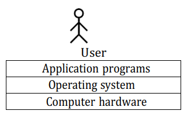

**Application Software**: Performs specific task for the user.
**System Software**: operates and controls the computer system and provides a platform to run application software.

An **Operating System** is a piece of software that manages all resources of a computer system, both hardware and software, and provides an environment in which the user can execute his/her programs in a convenient and efficient mannar by hiding underlying complexity of the hardware and acting as a resource manager.

**Why OS?**
1. What if there is no OS?
	1. Bulky and complex app.(Hardware interaction code must be in app's code base)
	2. Resource exploitation by 1 App.
	3. No memory protection.
2. What is an OS made up of?
	1. Collection of system software.

*An operating system function -*
- Access to the computer hardware. 
- interface between the user and the computer hardware.
- Resource management (Aka, Arbitration) (memory, device, file, security, process etc)
- Hides the underlying complexity of the hardware. (Aka, Abstraction)
- facilitates execution of application programs by providing isolation and protection.

The operating system provides the means for proper use of the resources in the operation of the computer system.

