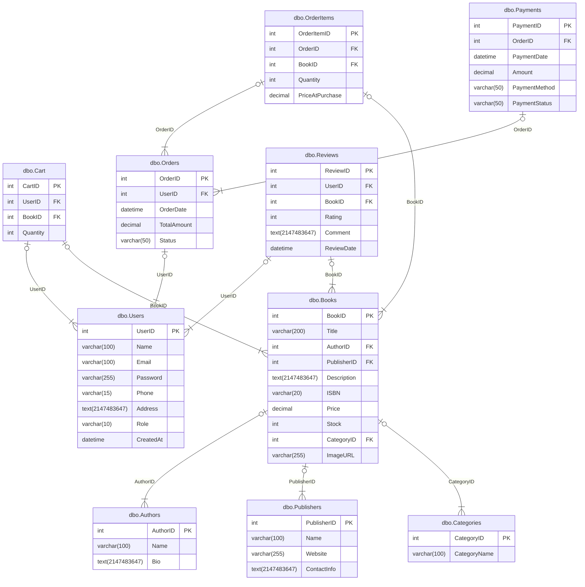

erDiagram
      
"dbo.Users" {
    int UserID "PK"
          varchar(100) Name ""
          varchar(100) Email ""
          varchar(255) Password ""
          varchar(15) Phone ""
          text(2147483647) Address ""
          varchar(10) Role ""
          datetime CreatedAt ""
          
}
"dbo.Authors" {
    int AuthorID "PK"
          varchar(100) Name ""
          text(2147483647) Bio ""
          
}
"dbo.Publishers" {
    int PublisherID "PK"
          varchar(100) Name ""
          varchar(255) Website ""
          text(2147483647) ContactInfo ""
          
}
"dbo.Categories" {
    int CategoryID "PK"
          varchar(100) CategoryName ""
          
}
"dbo.Books" {
    int BookID "PK"
          varchar(200) Title ""
          int AuthorID "FK"
          int PublisherID "FK"
          text(2147483647) Description ""
          varchar(20) ISBN ""
          decimal Price ""
          int Stock ""
          int CategoryID "FK"
          varchar(255) ImageURL ""
          
}
"dbo.Cart" {
    int CartID "PK"
          int UserID "FK"
          int BookID "FK"
          int Quantity ""
          
}
"dbo.Orders" {
    int OrderID "PK"
          int UserID "FK"
          datetime OrderDate ""
          decimal TotalAmount ""
          varchar(50) Status ""
          
}
"dbo.OrderItems" {
    int OrderItemID "PK"
          int OrderID "FK"
          int BookID "FK"
          int Quantity ""
          decimal PriceAtPurchase ""
          
}
"dbo.Reviews" {
    int ReviewID "PK"
          int UserID "FK"
          int BookID "FK"
          int Rating ""
          text(2147483647) Comment ""
          datetime ReviewDate ""
          
}
"dbo.Payments" {
    int PaymentID "PK"
          int OrderID "FK"
          datetime PaymentDate ""
          decimal Amount ""
          varchar(50) PaymentMethod ""
          varchar(50) PaymentStatus ""
          
}
      "dbo.Books" |o--|{ "dbo.Authors": "AuthorID"
"dbo.Books" |o--|{ "dbo.Publishers": "PublisherID"
"dbo.Books" |o--|{ "dbo.Categories": "CategoryID"
"dbo.Cart" |o--|{ "dbo.Users": "UserID"
"dbo.Cart" |o--|{ "dbo.Books": "BookID"
"dbo.Orders" |o--|{ "dbo.Users": "UserID"
"dbo.OrderItems" |o--|{ "dbo.Orders": "OrderID"
"dbo.OrderItems" |o--|{ "dbo.Books": "BookID"
"dbo.Reviews" |o--|{ "dbo.Users": "UserID"
"dbo.Reviews" |o--|{ "dbo.Books": "BookID"
"dbo.Payments" |o--|{ "dbo.Orders": "OrderID"
